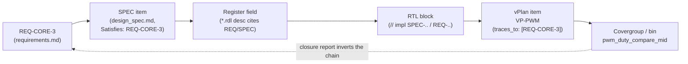
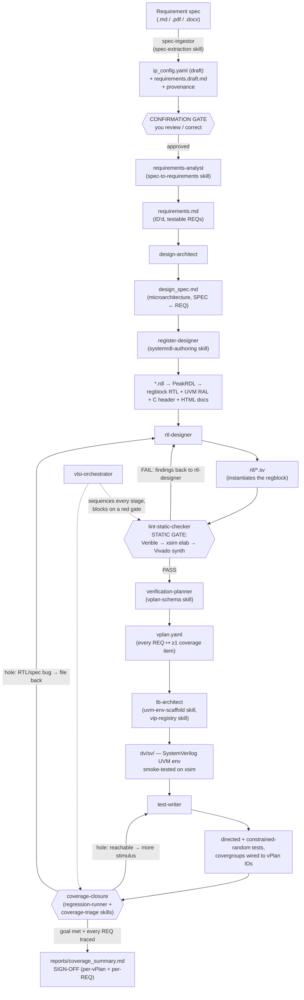
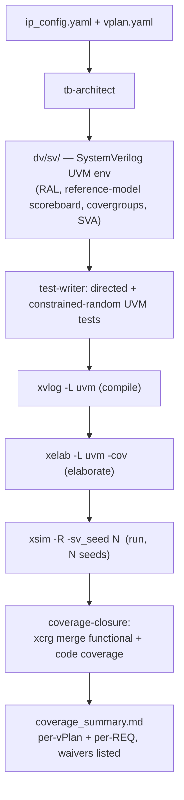

# VLSI Front-End Agentic Framework

> **Status.** The single-IP framework, proven end-to-end on the PMTPC-4 timer/PWM IP — release
> [`pmtpc4-v1.0`](../../releases/tag/pmtpc4-v1.0): 41/41 regression; functional coverage 99.72%,
> union 99.90%; statement 99.87 / branch 98.09 / condition 100; DUT code toggle 458/490 = 100% net
> of one documented constant net; register-bit toggle 486/486.

A multi-agent framework that drives the **front-end VLSI development lifecycle** for any
IP or subsystem — from **Requirements & Specifications** through **Design Specification**,
**Register Specification**, **RTL Design**, and **SystemVerilog UVM verification to 100% coverage
closure** — using **free / free-to-use EDA tools** only.

> Front-end scope only. No physical design, no place-and-route, no paid EDA vendors
> (Cadence / Synopsys / Siemens). The one non-open-source tool is AMD Vivado **xsim**, used under its
> free ML Standard edition (no license file) — see [Toolchain](#toolchain-all-free--free-to-use).

> **New to this project?** If you don't yet have WSL2, Claude Code, Vivado xsim, or the toolchain set
> up, start at **[`GETTING_STARTED.md`](GETTING_STARTED.md)** — a from-zero tutorial. Come back here
> once that's done for the full architecture.

---

## One input: a requirement spec

The front door is a **requirement specification document** for any IP or subsystem. You run:

```
/vlsi-ingest path/to/requirement_spec.(md|pdf|docx)
```

and the `spec-ingestor` agent **extracts** a draft `ip_config.yaml` + requirements from it, then
**stops at a confirmation gate** for you to review/correct. Once confirmed, the flow runs itself:
design spec → registers + register verification → RTL → verification → **coverage closure**.

## What makes it generic

Nothing is hardcoded per IP. Every agent and skill parameterizes off a single declarative
[`ip_config.yaml`](flow/config/ip_config.example.yaml) (clocks, resets, bus, register-map source,
interfaces, interrupts, verification intent). **Protocols are open-ended:** `bus.protocol` and
interface `kind` resolve through a pluggable [`vip_registry.yaml`](flow/config/vip_registry.yaml), so
any protocol is added by registering a VIP — never by editing agents or the schema. Reusable
**Verification IP (VIP)** is built once under [`vip/`](vip/) and instantiated from config. The schema
is also **subsystem-ready** (an optional `subsystem` block) so multi-block integration verification
can be added without reworking single-IP configs.

## Single-track SystemVerilog UVM

Every IP gets **one verification environment: standard SystemVerilog UVM**, generated from the
`ip_config.yaml` + vPlan and run on **AMD Vivado xsim**:

- `uvm_pkg`, factory, `config_db`, sequencer/driver/monitor, RAL, virtual sequences, covergroups, SVA.
- **Native constrained randomization** — `rand`/`constraint`/`dist`/`solve...before`/`randomize()` on
  a real solver, not a software re-implementation.
- **Functional + code coverage** via `xelab -cov` + `xcrg`, merged across seeds.

> **Why xsim, and why one track.** This framework was forked from a dual-track design (SV/UVM *plus*
> a pyuvm/cocotb Python twin) that leaned on Verilator and fell back to Python whenever Verilator's
> UVM support fell short — which, on a real IP, was always. That dual-track is gone. xsim is the only
> free, local, headless simulator that runs *complete* standard UVM (constraints + coverage + SVA), so
> the SV/UVM env is now the single source of truth and is actually executed. Its one gap — xsim does
> not report *assertion coverage* (assertions still run) — is handled by routing that evidence through
> the scoreboard and SVA `cover`.

## The traceability spine

A single ID threads every artifact: **Requirement → Design-spec section → Register/field →
RTL module → vPlan item → covergroup/bin.** Coverage closure is reported at the *requirement*
level, not just as bin counts — the way a real DV lead signs off.



---

## How it works — agents, skills, and the end-to-end flow

Three layers, each with a distinct job:

- **Commands** (`.claude/commands/`, the `/vlsi-*` entry points) — what *you* type to kick off a
  stage or the whole flow for a chosen IP.
- **Agents** (`.claude/agents/`) — one specialist per lifecycle stage, each with its own inputs,
  outputs, and rules, plus a `vlsi-orchestrator` that sequences them and enforces the gates between
  stages.
- **Skills** (`.claude/skills/`) — reusable, IP-agnostic *methodology* (schemas, conventions,
  triage procedures) that agents read and follow. An agent knows *when* to act; a skill knows *how*.

### The pipeline, stage by stage



`vlsi-orchestrator` is the conductor: `/vlsi-flow <ip>` hands it the whole run, and it walks the
pipeline above stage by stage, refusing to advance past a red gate. You can also run any single
stage directly (`/vlsi-registers`, `/vlsi-rtl`, …) when you only need to redo one link in the chain.

### Compile → elaborate → run → cover, on xsim

`tb-architect` and `test-writer` produce one SystemVerilog UVM environment from the
`ip_config.yaml` + `vplan.yaml`; `coverage-closure` drives it across seeds and rolls results up to
requirements.



### Agents — one specialist per stage

| Agent | Runs when | Reads | Produces |
|---|---|---|---|
| `spec-ingestor` | First contact with a new IP | A raw spec document (any format) | Draft `ip_config.yaml` + `requirements.draft.md`, then **stops** at the confirmation gate |
| `requirements-analyst` | After the config is confirmed | The confirmed spec material | `spec/requirements.md` — uniquely-ID'd, testable requirements |
| `design-architect` | After requirements exist | `requirements.md`, `ip_config.yaml` | `spec/design_spec.md` — block diagram, datapath/control, register-to-function map |
| `register-designer` | After the design spec defines the register map | `design_spec.md` | `rdl/<ip>.rdl` + PeakRDL-generated regblock RTL, UVM RAL, C header, HTML docs |
| `rtl-designer` | After registers exist | `design_spec.md`, the generated regblock | `rtl/*.sv` — synthesizable RTL instantiating the regblock |
| `lint-static-checker` | After any RTL change, before simulation | RTL + generated regblock | Pass/fail **static gate** (`static_gate.py`): Verible lint → xsim elaboration → Vivado synthesis |
| `design-reviewer` | RTL claimed complete, or changed later (incl. by `coverage-closure`) | Spec docs read independently, then the RTL | Spec-conformance findings + a traceability-completeness tally — **reviews, never fixes** |
| `verification-planner` | After the design spec + registers exist | `requirements.md`, `design_spec.md`, `<ip>.rdl` | `vplan/vplan.yaml` — every requirement mapped to ≥1 concrete coverage item |
| `tb-architect` | After the vPlan exists and RTL passes the static gate | `vplan.yaml`, `ip_config.yaml`, reusable VIP | The `dv/sv/` SystemVerilog UVM environment, smoke-tested on xsim |
| `test-writer` | After the environment is up and smoke-passing | `vplan.yaml`, the generated env | Directed + native constrained-random tests/sequences, covergroups wired to vPlan IDs |
| `coverage-closure` | Once tests exist | Regression results, `vplan.yaml` | `reports/coverage_summary.md` — regress on xsim, merge, triage holes, iterate to the goal |
| `verification-reviewer` | Coverage goal claimed met, or the DV env changes | `dv/sv/`, `vplan.yaml`, `coverage_summary.md` | Vacuity/waiver findings + a trustworthiness verdict, incl. a mutation/bug-seeding spot-check — **reviews, never fixes** |
| `vlsi-orchestrator` | Whole-flow or multi-stage runs | The IP's current state | Sequences the above, refusing to pass a red gate to the next stage |

### Skills — the durable methodology each agent draws on

| Skill | What it teaches |
|---|---|
| `spec-extraction` | How to pull a structured `ip_config.yaml` + first-cut requirements out of an arbitrary spec document, tagging every extracted fact with source + confidence |
| `spec-to-requirements` | How to turn spec material into a uniquely-ID'd, testable requirements database — the root of the traceability spine |
| `ip-config` | The `ip_config.yaml` schema itself — clocks, resets, bus, registers, verification intent — and how to validate it |
| `vip-registry` | How the pluggable VIP registry keeps the flow protocol-agnostic: selecting an existing bus/interface VIP, or registering a brand-new one, with no agent or schema edits |
| `systemrdl-authoring` | SystemRDL 2.0 conventions and driving PeakRDL to generate regblock RTL, UVM RAL, C headers, HTML docs |
| `vplan-schema` | The vPlan schema and its rules — every requirement must appear in ≥1 item, no orphan items, bins must be reachable and named |
| `uvm-env-scaffold` | The standard, industry-grade UVM architecture to generate for any IP: reusable protocol UVC, layered env (RAL + reference-model scoreboard + coverage + virtual sequencer), test/sequence library, SVA layer — plus the xsim compatibility rules |
| `regression-runner` | How to compile, elaborate, run, and regress the UVM env on xsim across seeds, collecting + merging functional and code coverage |
| `constrained-random` | How to implement `method: constrained-random` vPlan items with native SystemVerilog `rand`/`constraint`/`dist`, one seeded test per item, biased to the requirement's corners |
| `coverage-triage` | The method for closing coverage holes: classify each one (reachable → stimulus, unreachable → justified waiver, bug → file back), and roll results up to requirement-level closure |
| `design-review` | How to independently re-derive expected RTL behavior from spec/register/requirement docs and compare it against the RTL — the specific bug classes (protocol-phase timing, FSM transition fidelity, shadow-register semantics, hw set/clear precedence) that pass lint/elaboration/simulation but violate the spec |
| `verification-review` | How to audit whether a DV environment's checks are real: scoreboard/assertion vacuity, coverage-model integrity, waiver legitimacy, and the mutation/bug-seeding technique for proving a checker can actually fail |

### Commands — your entry points

| Command | Does |
|---|---|
| `/vlsi-ingest <spec> [ip_name]` | The front door: extract config + requirements, stop at the confirmation gate |
| `/vlsi-new-ip` | Manual/advanced: scaffold a new IP from a hand-authored config instead |
| `/vlsi-spec` | Requirements database + design specification |
| `/vlsi-registers` | SystemRDL + PeakRDL generation |
| `/vlsi-rtl` | RTL authoring + static gate |
| `/vlsi-build-env` | vPlan + SystemVerilog UVM testbench + smoke test on xsim |
| `/vlsi-verify` | Directed + constrained-random tests + initial coverage |
| `/vlsi-close-coverage` | The closure loop to the coverage goal |
| `/vlsi-review <ip> [design\|verification]` | Independent design and/or verification review — before treating either as signed off |
| `/vlsi-flow <ip>` | The whole pipeline, unattended, after the confirmation gate |
| `/vlsi-status <ip>` | Lifecycle status: which artifacts exist, gate status, coverage, what to run next |

---

## Reference IP (PMTPC-4)

A 4-channel timer/PWM controller (APB, SystemRDL register map, 5 binding errata) is the reference IP
carried through this pipeline. Its complete SystemVerilog UVM environment
([`ips/pmtpc4/dv/sv/`](ips/pmtpc4/dv/sv/)) **compiles, elaborates, and runs on Vivado xsim** — UVM
phasing, factory, `config_db`, RAL, reference-model scoreboard, and SVA all execute. Bringing it up on
a real UVM simulator immediately surfaced (and fixed) bugs the previous Python-only flow never could:
a reserved-keyword task name, a RAL/DUT class-name collision, a non-factory RAL block, and a
white-box-SVA X-sampling issue (see [`env/README.md`](env/README.md) and the project's memory notes).

Lessons from the bring-up, worth knowing before you start your own IP:

- **The coverage model must be sampled from a checked signal, never hand-invoked by a test.** A test's
  job is to *create* a scenario; the monitor/scoreboard samples coverage from a signal it just
  checked. Tests that call the coverage API directly produce green numbers with nothing verified — the
  single most important lesson.
- **Waivers must be matched by rule, not by name.** An allow-list of "these specific bins are exempt"
  quietly stops catching *new* holes that share a name; match by structural pattern instead.
- **Static analysis (lint/elaborate) does not prove spec conformance.** Bugs that pass lint,
  elaboration, and initial simulation (a protocol phase decoded from a registered instead of
  combinational state, a skipped FSM state, a missing hardware-clear, a live read where the spec
  required a shadowed one) are exactly what `design-reviewer` exists to catch early and
  `verification-reviewer` exists to confirm the dynamic checks can actually fail.
- **A generated environment that is never simulated is not verification.** The whole reason for
  single-track-on-xsim is that the SV/UVM env now actually runs — the failure mode of the old
  dual-track was authoring an SV env that was never executed.

---

## Independent review: `/vlsi-review`

Two audits, run separately from the agents that author the thing they check — the same discipline
real signoff processes require (a *different* engineer reviews the design; OpenTitan's checklist is
explicit about this):

- **`design-reviewer`** re-derives expected RTL behavior from the design spec, register spec, and
  requirements — cold, before looking at the RTL's own comments — and reports where they diverge.
- **`verification-reviewer`** audits whether the verification collateral that produced a coverage
  number can actually detect a bug: environment wiring, scoreboard/assertion vacuity, coverage-model
  integrity, and waiver legitimacy — including a deliberate, temporary mutation/bug-seeding spot-check.

Both **report findings; neither fixes what it finds** — that separation is the point. Run with
`/vlsi-review <ip>` (or `design`/`verification` alone) once RTL or coverage closure is claimed
complete, before treating either as signed off.

---

## Toolchain (all free / free-to-use)

| Stage | Tool |
|---|---|
| Register spec → RTL, UVM RAL, C headers, docs | **PeakRDL** (SystemRDL 2.0) |
| Lint / format / parse | **Verible** |
| **UVM simulation (compile / elaborate / run / coverage)** | **AMD Vivado xsim** (free ML Standard; `xvlog`/`xelab`/`xsim`/`xcrg`) |
| Static gate: elaboration + synthesizability | **AMD Vivado** (`xvlog`/`xelab`, `synth_design`) + **Verible** |

Vivado xsim is a **manual install** (free, Linux, into WSL2); everything else is installed by the
bootstrap. See [`env/`](env/) for pinned versions, the WSL2 bootstrap, and the Vivado install steps.

## Repository layout

The abstract shape (what every new IP gets):

```
.claude/{agents,skills,commands}/   the multi-agent framework itself
flow/config/        ip_config schema + validator + vip_registry (pluggable protocols)
flow/{templates,scripts,tools}/     engine: templates, xsim flow-runner scripts, tool wrappers
vip/<bus>/sv/       reusable SystemVerilog UVM VIP, selected via the registry
ips/<name>/         YOUR IPs: spec/ rdl/ rtl/ dv/sv/ vplan/ reports/
env/                WSL2 bootstrap + pinned tool versions + Docker option + Vivado install steps
docs/               design docs and this framework's own documentation
```

The concrete tree (generated/git-ignored output — `rdl/generated/`, `env/.venv/`, `env/_tools/`,
xsim build/coverage dirs, `reports/_runs`, `reports/_cov` — omitted; see [`.gitignore`](.gitignore)):

```
.
├── GETTING_STARTED.md            ← start here if you're new
├── README.md                     this file
├── commands.md                   every command actually run, setup through closure
├── CLAUDE.md                     project guidance Claude Code reads on every session
│
├── .claude/
│   ├── agents/                   13 specialists — see "Agents" table above
│   ├── skills/                   12 durable methodologies — see "Skills" table above
│   └── commands/                 11 slash commands — see "Commands" table above
│
├── flow/                          the generic engine (protocol-agnostic, no per-IP code)
│   ├── config/                   ip_config.schema.json + ip_config.example.yaml + vip_registry.yaml
│   └── scripts/                  validate_config.py, static_gate.py, xsim_flow.sh, run_regression.py
│
├── vip/                           reusable Verification IP, built once, instantiated from config
│   └── apb/sv/                   apb_if, apb_agent(+driver/monitor/seqr), apb_coverage,
│                                  apb_reg_adapter, apb_seq_lib, apb_pkg, apb.f
│
├── ips/                           YOUR real IPs live here
│   ├── README.md
│   └── pmtpc4/                    ← the reference IP (UVM env runs on xsim)
│       ├── ip_config.yaml
│       ├── spec/                  requirements.md, design_spec.md + source documents
│       ├── rdl/pmtpc4.rdl         (→ rdl/generated/: regblock RTL, UVM RAL, C header, HTML — git-ignored)
│       ├── rtl/                   pmtpc4.sv, pmtpc4_apb_slave.sv, pmtpc4_channel.sv, pmtpc4_prescaler.sv
│       ├── vplan/vplan.yaml       every requirement traced
│       ├── dv/sv/                 the SystemVerilog UVM env — env/ seq/ sva/ test/ tb/, filelist.f
│       └── reports/               regression + coverage output (git-ignored, regenerated)
│
├── env/                            toolchain bootstrap (WSL2 + Docker) + Vivado install steps
│   ├── README.md, bootstrap-wsl2.sh, tool-versions.yaml, Dockerfile
│   └── _tools/uvm-core/           bundled Accellera UVM sources (for UVM 2017/2020), .venv/ — git-ignored
│
└── docs/
    ├── architecture.md             design rationale + phased roadmap
    └── vlsi_agent_flow_architecture.html   the illustrated architecture doc
```

## Getting started

*Never set this up before? [`GETTING_STARTED.md`](GETTING_STARTED.md) walks through WSL2, Claude
Code, Vivado xsim, and the toolchain from a blank machine. The steps below assume that's already done.*

1. Install the free toolchain, then Vivado xsim (from a WSL2 Ubuntu shell):
   ```bash
   bash env/bootstrap-wsl2.sh      # Verible + PeakRDL venv (everything else is Vivado)
   # then install Vivado ML Standard (xsim) manually — see env/README.md
   ```
2. Ingest a requirement spec — the front door:
   ```
   /vlsi-ingest path/to/your_requirement_spec.md my_ip
   ```
   Review/correct the extracted config at the confirmation gate, then run the flow:
   ```
   /vlsi-flow my_ip
   ```
3. Or run the reference IP directly:
   ```bash
   bash flow/scripts/xsim_flow.sh smoke ips/pmtpc4 pmtpc4_sanity_test
   python3 flow/scripts/run_regression.py ips/pmtpc4
   ```
   Individual stages: `/vlsi-spec`, `/vlsi-registers`, `/vlsi-rtl`, `/vlsi-build-env`,
   `/vlsi-verify`, `/vlsi-close-coverage`, `/vlsi-status`.

## Roadmap

- **P0 — Foundation** *(done)*: repo skeleton, toolchain bootstrap, `ip_config` schema, agents/skills/commands.
- **P1 — Spec front door**: requirement-doc ingestion → auto-extracted config + requirements → confirmation gate → design spec.
- **P2 — Registers + RTL**: SystemRDL → PeakRDL, RTL generation, lint + elaboration gates.
- **P3 — UVM env + VIP**: first bus VIP (APB) + generated SV/UVM env running on xsim; register verification (RAL).
- **P4 — vPlan + functional tests**: coverage model + native constrained-random/directed tests.
- **P5 — Closure loop**: seeded regression + coverage triage + auto gap-closing to the goal.
- **P6 — Generalize**: prove protocol-agnosticism (AXI-Lite via the registry) and subsystem hierarchy.

The single-track SV/UVM-on-xsim environment is proven running on `ips/pmtpc4`; the *generic, templated*
engine (`flow/templates/`) that would generate it for every new IP automatically is still being built —
today's methodology lives in `.claude/agents`/`.claude/skills` prose and the reference IP's files.

See [docs/architecture.md](docs/architecture.md) for the full design.
